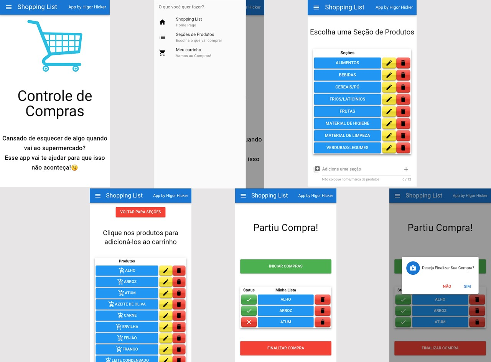

# Shopping List

## Objetivos
- Muitas pessoas vão ao mercado e as vezes esquecem um produto, e isso é uma coisa incoveniente. Pensando nisso, esse aplicativo foi elaborado pensando em acabar com esse problema e até mesmo substituir o papel e caneta, ja que hoje a tecnologia está dominando em todas as áreas!
---------------------------------------------------------
>## Requisitos Funcionais
>- Mostrar uma lista de seções de um supermercado;
>- Cada seção deve conter seus respectivos produtos;
>- O usuário poderá entrar/editar/excluir uma seção;
>- O usuário poderá editar/excluir um produto;
>- Quando o usuário selecionar o produtoe, o mesmo deverá ir para o "carrinho";
>- No "carrinho", o usuário pode confirmar/excluir o produto;
>- No "carrinho", o usuário pode iniciar/finalizar compra.
----------------------------------------------------------
>## Requisitos Não Funcionais
>- Projeto Web;
>- Projeto PWA;
>- A linguagem usada foi Vue.js, baseada em JavaScript;
>- Possui banco de dados integrado;
>- Framework Quasar para estilização.
----------------------------------------------------------
>## Regras de negócio
>- O usuário não pode finalizar a compra sem que antes tenha iniciado;
>- A compra não pode iniciar sem que tenha ao menos um produto no "carrinho".
----------------------------------------------------------
# Rodando em sua máquina
## Após clonar este repositório em sua máquina, você deve abrir o terminal na pasta do projeto e rodar o seguinte comando:
- ### ***quasar dev***

# Aplicativo em produção

## A partir de então, basta esperar o código compilar e executar em:
- ### ***http://localhost:8080/#/***

## Dentro da pasta ***/dist*** está o projeto em PWA, que está fucionando atualmente neste link:
- ### ***https://complist.netlify.app***

# DIVIRTA-SE!
### Atenciosamente, Higor Hicker.